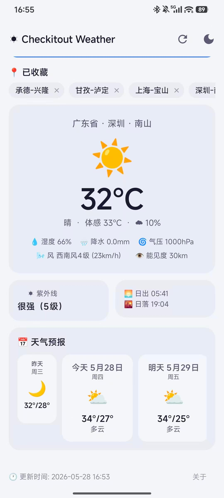
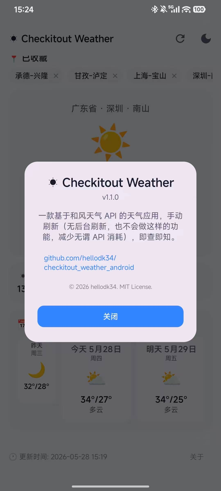

# Checkitout Weather ☀️

一个基于 **Jetpack Compose** 和 **和风天气 API** 的 Android 天气应用。Release APK 仅 1.8MB 大小。

## 功能

- 🔍 **城市搜索** — 搜索全球城市，支持多结果选择
- 💾 **城市收藏** — 保存常用城市，一键切换，数据持久化
- 🌡️ **当前天气** — 温度、体感温度、天气现象、云量、湿度、降水量、气压、风向风速（蒲福风级）、能见度
- 🌅 **日出日落** — 当日日出/日落时间
- ☀️ **紫外线指数** — 当日最高紫外线指数（*并非实时，和风天气API无实时 UV index*）与等级描述
- 📅 **天气预报** — 昨日天气 + 未来 7 天预报，含日期、天气图标、最高/最低温
- 🌫️ **空气质量** — AQI 数值、等级颜色标识、PM2.5、PM10、首要污染物
- 🌗 **深色模式** — 手动切换深色/浅色主题
- 🔄 **手动刷新** — 随时获取最新天气数据

## 截图




## 技术栈

| 类别 | 技术 |
|------|------|
| 语言 | Kotlin |
| UI | Jetpack Compose + Material3 |
| 架构 | MVVM（ViewModel + StateFlow + Repository） |
| 网络 | Retrofit 2 + OkHttp 4 + Gson |
| 认证 | EdDSA (Ed25519) JWT 令牌认证 |
| 数据持久化 | Jetpack DataStore Preferences |
| 协程 | Kotlin Coroutines |
| 最低 SDK | Android 5.0 Lollipop (API 21)，覆盖 97% 以上活跃设备 |
| 目标 SDK | Android 15 (API 35) |

## 开始使用

### 配置和风天气 API

1. 注册[和风天气控制台](https://console.qweather.com/) 账号
2. 创建项目，获取 **Project ID**
3. 进入项目创建凭据，认证方式选择 **JWT**
4. 使用 OpenSSL 生成 Ed25519 密钥对：

```bash
openssl genpkey -algorithm ED25519 -out ed25519-private.pem
openssl pkey -pubout -in ed25519-private.pem > ed25519-public.pem
```

5. 将 `ed25519-public.pem` 内容粘贴到凭据创建页面
6. 打开 `app/src/main/java/com/checkitout/weather/data/AuthConstants.kt`，填写以下信息：

```kotlin
const val HOST = "你的 HOST（如 devapi.qweather.com）"
const val PROJECT_ID = "你的 project id"
const val CREDENTIAL_ID = "你的 credential id"
const val PRIVATE_KEY_PEM = "你的 Ed25519 私钥（仅 PEM 文件第二行内容）"
```

### 构建

```bash
./gradlew assembleDebug
```

APK 将生成在 `app/build/outputs/apk/debug/`。

## 项目结构

```
app/src/main/java/com/checkitout/weather/
├── MainActivity.kt              # 入口 Activity
├── WeatherApp.kt                 # Application 类
├── data/
│   ├── AuthConstants.kt          # API 认证配置
│   ├── SavedCitiesManager.kt     # 城市持久化管理
│   ├── api/
│   │   ├── DomainModels.kt       # 领域模型
│   │   ├── QWeatherApi.kt        # Retrofit API 接口
│   │   ├── QWeatherAuth.kt       # EdDSA JWT 令牌生成
│   │   └── WeatherModels.kt      # API 响应 DTO
│   └── repository/
│       └── WeatherRepository.kt  # 数据仓库
├── ui/
│   ├── MainScreen.kt             # 顶层 Composable
│   ├── screens/
│   │   └── WeatherScreen.kt      # 天气主界面
│   ├── components/
│   │   ├── AboutDialog.kt        # 关于对话框
│   │   ├── AirQualitySection.kt  # 空气质量卡片
│   │   ├── CityPickerDialog.kt   # 城市选择对话框
│   │   ├── CurrentWeatherSection.kt  # 当前天气卡片
│   │   ├── ForecastSection.kt    # 天气预报卡片
│   │   ├── SavedCityChip.kt      # 已保存城市标签
│   │   └── SunriseSunsetSection.kt  # 日出日落卡片
│   └── theme/
│       ├── Color.kt              # 颜色定义
│       ├── Theme.kt              # Material3 主题
│       └── Type.kt               # 字体排版
├── util/
│   └── WeatherUtils.kt           # 工具函数
└── viewmodel/
    └── WeatherViewModel.kt       # ViewModel & UiState
```

## 许可

[MIT License](./LICENSE) © 2026 Allen Hua
